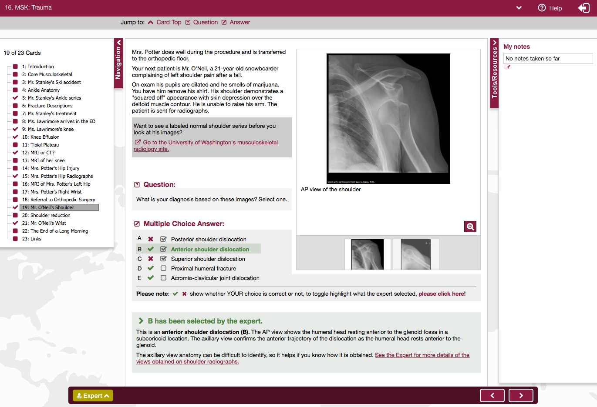
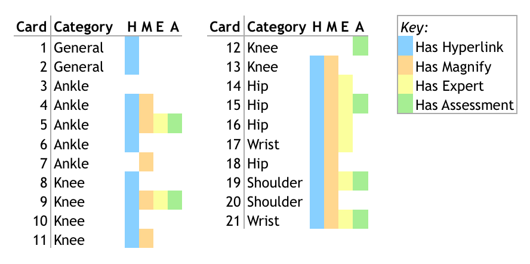
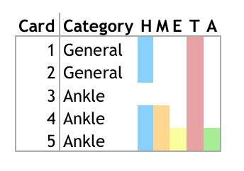
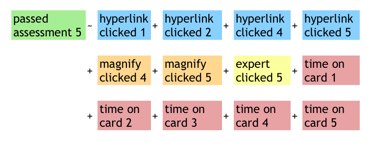
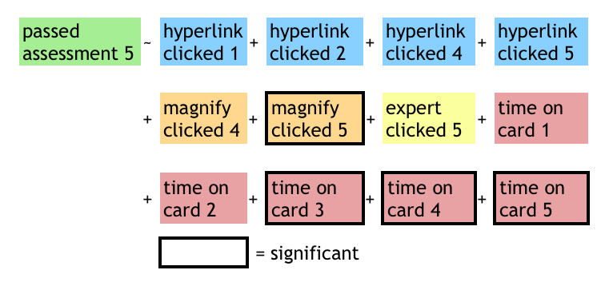
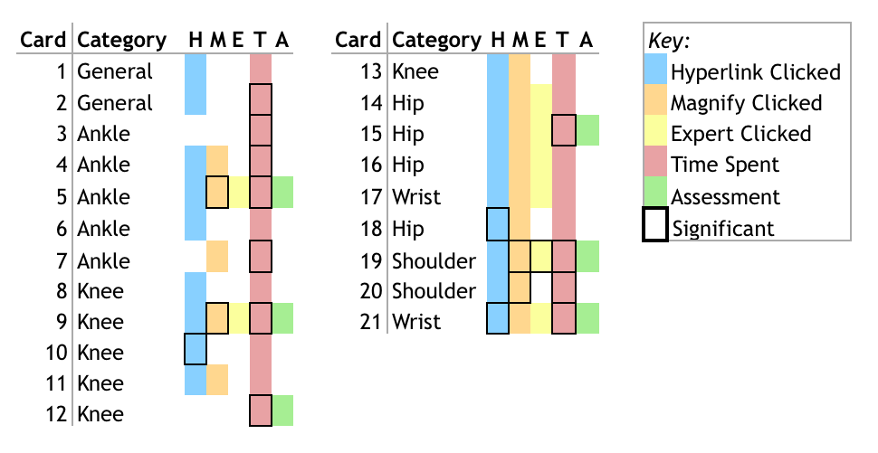

```{r setup, include=FALSE}
knitr::opts_chunk$set(cache=TRUE, warning=FALSE)
```

###Document Setup: Run Code
This loads the data and dependencies, and builds models for demonstration. Procedure explained later in the document.
```{r echo=TRUE, results='hide', message=FALSE, warning=FALSE}
library(knitr)
library(reshape) #for processing
library(party)
library(ROCR)
library(ggplot2)
library(glmnet) #regularization


#setwd('~/git/edsp')
source('scripts/explore_data.R')
source('scripts/processing.R')
source('scripts/model_functions.R')

df = load_data('data/fullData.csv','data/dataDefs.csv')

#investigation 1a
lin_data = process_for_linear(df)
lin_train = lin_data[[1]]
lin_test = lin_data[[2]]

#investigation 1b
data = process_data(df)
train=data[[1]]
test=data[[2]]

#investigation 2
data_w = widen(df)
train_w = data_w[[1]]
test_w = data_w[[2]]

#build models
source('scripts/models.R')
```

#Project Overview
Thanks to data recorded in online courses, we can now evaluate what content does and does not impact student learning. By building a model that uses learning activity engagement to predict student assessment performance, we can take an analytical approach to instructional design. This project demonstrates this technique on the MedU CORE Radiology course.  


#About the Data
Student performance is measured by score on multiple-choice questions throughout the 23-card unit. Learning activities on cards include:

- reading material
- links
- images
- assessments throughout

##Screenshot of sample learning card


Different cards had different content and types of material on them. The figure below displays maps variables available on each card.



##Key Variables
Variables that may have an impact on student performance:

  - Clicking hyperlinks
  - Magnifying images
  - Checking answers using “expert” links
  - Time spent on cards
  

#Data Exploration

##Student Assessment Score ("Success")
Different questions had different measures for assessment score ("success").  The histogram below displays distribution of student assessment scores. 
```{r}
hist(train$success)
```

##Handling Time Transformation
Handling time was very skewed (see first chart below) so I used a log-transform (second chart)
```{r}
hist(train$handling_time)
hist(train$log_handling_time)
```

##Engagement Activity
Different cards had different numbers of links/magnify/expert options available. Most students clicked 0 or one item per unit.
```{r}
hist(train$hyperlink_clicks)
hist(train$magnify_clicks)
hist(train$expert_clicks)
```

#Train-Test Split
I split the students in the data up so that 80% were in a training set, and 20% were in the holdout test set.

#Investigation 1: Does Studying Work?
In the first investigation I sought to establish whether there was a relationship between student engagement and assessment performance. 


##Investigation 1a:Linear Model
A linear model to predict student score from the available measures of engagement

###Procedure
1. Restructure data: 1 line per student per assessment
    - assessments are aggregated together
1. Data transformations
    - log-transform handling_time
1. Linear model predicts student score from measures of engagement

###Results 
```{r}
lin_data = process_for_linear(df)
lin_train = lin_data[[1]]
lin_test = lin_data[[2]]
lin = lm(success ~ hyperlink_clicks + magnify_clicks + expert_clicks + log_handling_time, data=lin_train)
summary(lin)
```

##Investigation 1b: Binary Model, Aggregated
A logistic regression model to predict student score from the available measures of engagement

###Procedure
1. Restructure data: 1 line per student per assessment
   - assessments are aggregated together
1. Data transformations
   - convert assessment scores to pass/fail
   - converting clicks to binary
   - binary transform of handling_time
1. Classification model predicts if student will pass an assessment given measures of engagement

####Binarizing student score
To standardize the variables I converted 'success' to binary and called it 'label'. Label was defined as 1 if success>0.5 and 0 otherwise
```{r}
freq_table(train,'label')
```

####Bucketing time spent on cards
To see whether students were rushing or dragging (i.e. maybe walked away from the computer), I broke handling time into three segments: "time\_lt\_20" to indicate that the student averaged <20 seconds per card, and "time\_gt\_100" to indicate that the student averaged >100 seconds per card.
```{r}
freq_table(train,'time_lt_20')
freq_table(train,'time_gt_100')
```

####Engagement Activity
Different cards had different numbers of links/magnify/expert options available.  In order to make engagement comparable across cards, I also converted engagement activities to binary.
  - 'hyperlink\_clicks' became the binary 'hyperlink\_clicked'
  - 'magnify\_clicks' became the binary 'magnify\_clicked'
  - 'expert\_clicks' became the binary 'expert\_clicked'
```{r}
freq_table(train,'hyperlink_clicked')
freq_table(train,'magnify_clicked')
freq_table(train,'expert_clicked')
```

###Models and Results of Investigation 1b
I tried both logistic regression models and decision trees to predict student pass/fail, using either binary-transformed or untransformed variables. The table below summarizes the findings.  
```{r echo=FALSE}
kable(modelsDF,row.names=TRUE)
```

Below is an example result from one of the models, model #4, which is a logistic regression model using binary inputs and output.
```{r echo=FALSE}
summary(models[[4]])
auc = get_auc(models[[4]],test,test$label)
paste("auc on test of model 4 =",format(round(auc, 2), nsmall = 2))
```

#Investigation 2: Binary Model, Disaggregated
Which specific learning activities helped assessment score? Now that it has been established that studying and assessment score are correlated, which specific engagement activities make a student more likely to pass?  Again I use the binary pass/fail 'label' variable and build classifiers to predict. But this time I will compare individual hyperlinks against one another, and against magnificiation clicks, etc. The goal here is to help instructional designers 

Here is what the model looks like for the unit assessment on card 5:



##Procedure
1. Run lasso-regularized logistic regression using all activities before assessment card
1. Find largest regularization parameter that is close to maximum cross-validation AUC
1. Re-run logistic with remaining variables
1. Return variables that have significant impact with p-value < 0.05

##Results of Investigation 2

###Card 5
According to the model, the variables that are significant in predicting whether a student will pass card 5 are: magnifying the image on card 5, and rushing/not rushing on cards 3, 4, and 5.  
```{r}
summary(result_5$model)
print(result_5$auc)
```


##Results Table
The table below presents the significant predictors of student passing. Note that to predict whether a student passed the assessment on card 9, I included an indicator for whether he/she passed card 5. This is included as 'label_5', and is a significant predictor. I did the same for later unit assessments. 
```{r}
resultsDF = get_resultsDF()
kable(resultsDF)
```

The following image is another representation of significant predictors. Variables that were significant predictors for any assessment are boxed in black.  


#Next Steps
The next step is to examine the content of the MedU course and see if the findings of these investigations make intuitive sense. It may be obvious, for example, that magnifying the image in card 5 is the most significant predictor of passing card 5 because the question can't be answered without it. Furthermore I'd like to get ahold of a more robust, summative assessment that would be a more reliable measure of student understanding.

From there I would want to discuss the results with the MedU instructional designers and advise them to cut material that doesn't contribute to understanding, or add assessment questions to measure learning in cards that aren't currently significant predictors. 

Eventually I'd like to make this content reusable for any online course.

#Acknowledgments

Thanks to Matt Cirigliano, Martin Pusic, and Oleksandr Savenkov of NYU School of Medicine for providing data and consultation. And thank you to Yoav Bergner for his advice and guidance.