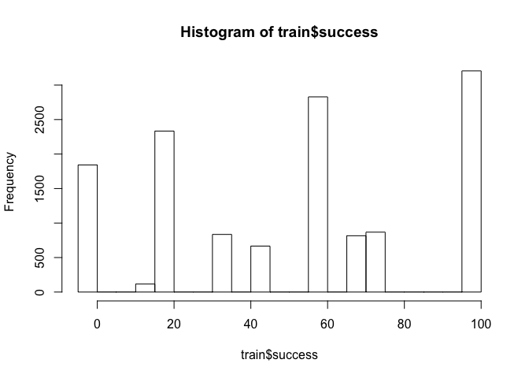
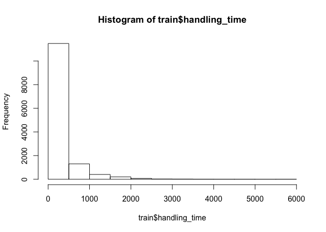
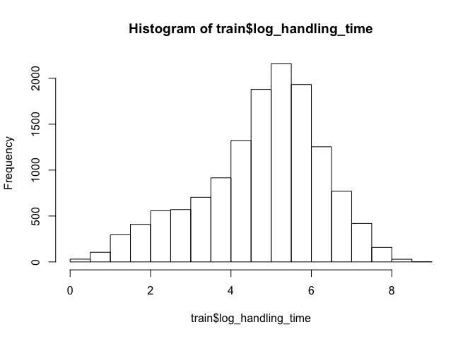
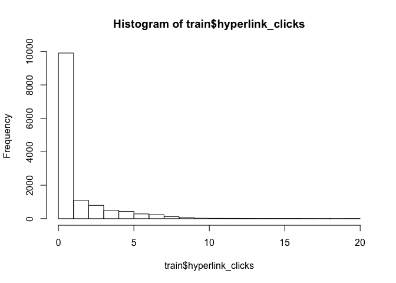
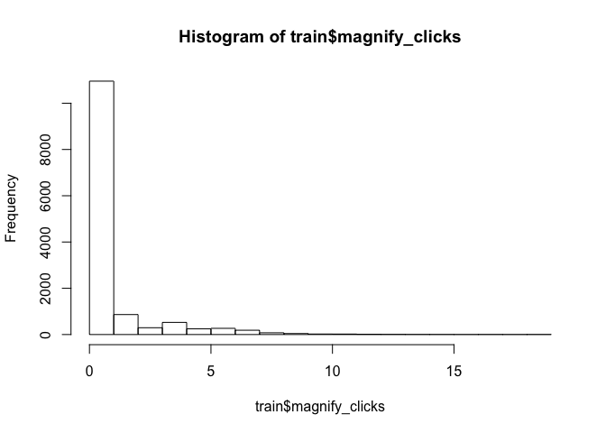
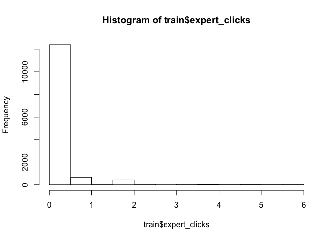

Project Overview
================

Thanks to data recorded in online courses, we can now evaluate what
content does and does not impact student learning. By building a model
that uses learning activity engagement to predict student assessment
performance, we can take an analytical approach to instructional design.
This project demonstrates this technique on the MedU CORE Radiology
course.

About the Data
==============

Student performance is measured by score on multiple-choice questions
throughout the 23-card unit. Learning activities on cards include:

-   reading material
-   links
-   images
-   assessments throughout

Screenshot of sample learning card
----------------------------------

Different cards had different content and types of material on them. The
figure below displays maps variables available on each card. 

Key Variables
-------------

Variables that may have an impact on student performance:

-   Clicking hyperlinks
-   Magnifying images
-   Checking answers using “expert” links
-   Time spent on cards

Run Code
--------

This loads the data and builds models for demonstration. Procedure
explained later in the document.

    library(knitr)
    setwd('~/git/edsp')
    source('scripts/explore_data.R')
    source('scripts/processing.R')
    source('scripts/model_functions.R')

    df = load_data('data/fullData.csv','data/dataDefs.csv')

    #investigation 1a
    lin_data = process_for_linear(df)
    lin_train = lin_data[[1]]
    lin_test = lin_data[[2]]

    #investigation 1b
    data = process_data(df)
    train=data[[1]]
    test=data[[2]]

    #investigation 2
    data_w = widen(df)
    train_w = data_w[[1]]
    test_w = data_w[[2]]

    #build models
    source('scripts/models.R')

Data Exploration
================

Student Assessment Score ("Success")
------------------------------------

Different questions had different measures for assessment score
("success"). The histogram below displays distribution of student
assessment scores.

    hist(train$success)

<!-- -->

Handling Time Transformation
----------------------------

Handling time was very skewed (see first chart below) so I used a
log-transform (second chart)

    hist(train$handling_time)

<!-- -->

    hist(train$log_handling_time)

<!-- -->

Engagement Activity
-------------------

Different cards had different numbers of links/magnify/expert options
available. Most students clicked 0 or one item per unit.

    hist(train$hyperlink_clicks)

<!-- -->

    hist(train$magnify_clicks)

<!-- -->

    hist(train$expert_clicks)

<!-- -->

Train-Test Split
================

I split the students in the data up so that 80% were in a training set,
and 20% were in the holdout test set.

Investigation 1: Does Studying Work?
====================================

In the first investigation I sought to establish whether there was a
relationship between student engagement and assessment performance.

Investigation 1a:Linear Model
-----------------------------

A linear model to predict student score from the available measures of
engagement

### Procedure

1.  Restructure data: 1 line per student per assessment
    -   assessments are aggregated together

2.  Data transformations
    -   log-transform handling\_time

3.  Linear model predicts student score from measures of engagement

### Results

    lin_data = process_for_linear(df)
    lin_train = lin_data[[1]]
    lin_test = lin_data[[2]]
    lin = lm(success ~ hyperlink_clicks + magnify_clicks + expert_clicks + log_handling_time, data=lin_train)
    summary(lin)

    ## 
    ## Call:
    ## lm(formula = success ~ hyperlink_clicks + magnify_clicks + expert_clicks + 
    ##     log_handling_time, data = lin_train)
    ## 
    ## Residuals:
    ##     Min      1Q  Median      3Q     Max 
    ## -66.840 -10.708   0.301  11.593  54.103 
    ## 
    ## Coefficients:
    ##                   Estimate Std. Error t value Pr(>|t|)    
    ## (Intercept)        37.3517     1.6965  22.017  < 2e-16 ***
    ## hyperlink_clicks    0.5859     0.4002   1.464    0.143    
    ## magnify_clicks      2.4531     0.4197   5.845 5.79e-09 ***
    ## expert_clicks      -0.3679     1.9158  -0.192    0.848    
    ## log_handling_time   2.3354     0.3651   6.397 1.92e-10 ***
    ## ---
    ## Signif. codes:  0 '***' 0.001 '**' 0.01 '*' 0.05 '.' 0.1 ' ' 1
    ## 
    ## Residual standard error: 16.45 on 2278 degrees of freedom
    ## Multiple R-squared:  0.09089,    Adjusted R-squared:  0.08929 
    ## F-statistic: 56.93 on 4 and 2278 DF,  p-value: < 2.2e-16

Investigation 1b: Binary Model, Aggregated
------------------------------------------

A logistic regression model to predict student score from the available
measures of engagement

### Procedure

1.  Restructure data: 1 line per student per assessment

-   assessments are aggregated together

1.  Data transformations

-   convert assessment scores to pass/fail
-   converting clicks to binary
-   binary transform of handling\_time

1.  Classification model predicts if student will pass an assessment
    given measures of engagement

#### Binarizing student score

To standardize the variables I converted 'success' to binary and called
it 'label'. Label was defined as 1 if success&gt;0.5 and 0 otherwise

    freq_table(train,'label')

    ## [1] "Frequencies for label"
    ## 
    ##    0    1 
    ## 0.43 0.57

#### Bucketing time spent on cards

To see whether students were rushing or dragging (i.e. maybe walked away
from the computer), I broke handling time into three segments:
"time\_lt\_20" to indicate that the student averaged &lt;20 seconds per
card, and "time\_gt\_100" to indicate that the student averaged &gt;100
seconds per card.

    freq_table(train,'time_lt_20')

    ## [1] "Frequencies for time_lt_20"
    ## 
    ##    0    1 
    ## 0.86 0.14

    freq_table(train,'time_gt_100')

    ## [1] "Frequencies for time_gt_100"
    ## 
    ##    0    1 
    ## 0.39 0.61

#### Engagement Activity

Different cards had different numbers of links/magnify/expert options
available. In order to make engagement comparable across cards, I also
converted engagement activities to binary. - 'hyperlink\_clicks' became
the binary 'hyperlink\_clicked' - 'magnify\_clicks' became the binary
'magnify\_clicked' - 'expert\_clicks' became the binary
'expert\_clicked'

    freq_table(train,'hyperlink_clicked')

    ## [1] "Frequencies for hyperlink_clicked"
    ## 
    ##    0    1 
    ## 0.59 0.41

    freq_table(train,'magnify_clicked')

    ## [1] "Frequencies for magnify_clicked"
    ## 
    ##    0    1 
    ## 0.67 0.33

    freq_table(train,'expert_clicked')

    ## [1] "Frequencies for expert_clicked"
    ## 
    ##    0    1 
    ## 0.92 0.08

### Models and Results of Investigation 1b

I tried both logistic regression models and decision trees to predict
student pass/fail, using either binary-transformed or untransformed
variables. The table below summarizes the findings.

<table>
<thead>
<tr class="header">
<th align="left"></th>
<th align="left">Model Type</th>
<th align="left">Activity Measure</th>
<th align="left">Time Spent</th>
<th align="left">AUC</th>
</tr>
</thead>
<tbody>
<tr class="odd">
<td align="left">1</td>
<td align="left">logistic</td>
<td align="left">scalar</td>
<td align="left">scalar</td>
<td align="left">0.589</td>
</tr>
<tr class="even">
<td align="left">2</td>
<td align="left">logistic</td>
<td align="left">scalar</td>
<td align="left">log-transformed</td>
<td align="left">0.589</td>
</tr>
<tr class="odd">
<td align="left">3</td>
<td align="left">logistic</td>
<td align="left">binary</td>
<td align="left">log-transformed</td>
<td align="left">0.593</td>
</tr>
<tr class="even">
<td align="left">4</td>
<td align="left">logistic</td>
<td align="left">binary</td>
<td align="left">binary</td>
<td align="left">0.596</td>
</tr>
<tr class="odd">
<td align="left">5</td>
<td align="left">tree</td>
<td align="left">scalar</td>
<td align="left">scalar</td>
<td align="left">0.597</td>
</tr>
<tr class="even">
<td align="left">6</td>
<td align="left">tree</td>
<td align="left">scalar</td>
<td align="left">log-transformed</td>
<td align="left">0.596</td>
</tr>
<tr class="odd">
<td align="left">7</td>
<td align="left">tree</td>
<td align="left">binary</td>
<td align="left">log-transformed</td>
<td align="left">0.597</td>
</tr>
<tr class="even">
<td align="left">8</td>
<td align="left">tree</td>
<td align="left">binary</td>
<td align="left">binary</td>
<td align="left">0.595</td>
</tr>
</tbody>
</table>

Below is an example result from one of the models, model \#4, which is a
logistic regression model using binary inputs and output.

    ## 
    ## Call:
    ## glm(formula = label ~ hyperlink_clicked + magnify_clicked + expert_clicked + 
    ##     time_lt_20 + time_gt_100, family = "binomial", data = train)
    ## 
    ## Deviance Residuals: 
    ##     Min       1Q   Median       3Q      Max  
    ## -1.5622  -1.2518   0.9056   1.0506   1.3147  
    ## 
    ## Coefficients:
    ##                   Estimate Std. Error z value Pr(>|z|)    
    ## (Intercept)       -0.01487    0.03685  -0.403  0.68663    
    ## hyperlink_clicked  0.18811    0.04131   4.554 5.28e-06 ***
    ## magnify_clicked    0.18530    0.04233   4.377 1.20e-05 ***
    ## expert_clicked     0.19103    0.06980   2.737  0.00621 ** 
    ## time_lt_20        -0.30221    0.05917  -5.107 3.27e-07 ***
    ## time_gt_100        0.32078    0.04335   7.400 1.36e-13 ***
    ## ---
    ## Signif. codes:  0 '***' 0.001 '**' 0.01 '*' 0.05 '.' 0.1 ' ' 1
    ## 
    ## (Dispersion parameter for binomial family taken to be 1)
    ## 
    ##     Null deviance: 18454  on 13510  degrees of freedom
    ## Residual deviance: 18073  on 13505  degrees of freedom
    ## AIC: 18085
    ## 
    ## Number of Fisher Scoring iterations: 4

    ## [1] "auc on test of model 4 = 0.61"

Investigation 2: Binary Model, Disaggregated
============================================

Which specific learning activities helped assessment score? Now that it
has been established that studying and assessment score are correlated,
which specific engagement activities make a student more likely to pass?
Again I use the binary pass/fail 'label' variable and build classifiers
to predict. But this time I will compare individual hyperlinks against
one another, and against magnificiation clicks, etc. The goal here is to
help instructional designers

Here is what the model looks like for the unit assessment on card 5:
 

Procedure
---------

1.  Run lasso-regularized logistic regression using all activities
    before assessment card
2.  Find largest regularization parameter that is close to maximum
    cross-validation AUC
3.  Re-run logistic with remaining variables
4.  Return variables that have significant impact with p-value &lt; 0.05

Results of Investigation 2
--------------------------

### Card 5

According to the model, the variables that are significant in predicting
whether a student will pass card 5 are: magnifying the image on card 5,
and rushing/not rushing on cards 3, 4, and 5.

    summary(result_5$model)

    ## 
    ## Call:
    ## glm(formula = model_spec, family = "binomial", data = train)
    ## 
    ## Deviance Residuals: 
    ##     Min       1Q   Median       3Q      Max  
    ## -1.3379  -1.0865  -0.3392   1.0250   2.4017  
    ## 
    ## Coefficients:
    ##                   Estimate Std. Error z value Pr(>|z|)    
    ## (Intercept)        -0.3877     0.1184  -3.273  0.00106 ** 
    ## magnify_clicked_5   0.5875     0.0949   6.191 5.99e-10 ***
    ## time_lt_20_3       -0.3543     0.1301  -2.723  0.00646 ** 
    ## time_lt_20_4       -0.3311     0.1278  -2.590  0.00960 ** 
    ## time_lt_20_5       -1.7534     0.4050  -4.329 1.50e-05 ***
    ## time_gt_100_5       0.1700     0.1110   1.532  0.12556    
    ## ---
    ## Signif. codes:  0 '***' 0.001 '**' 0.01 '*' 0.05 '.' 0.1 ' ' 1
    ## 
    ## (Dispersion parameter for binomial family taken to be 1)
    ## 
    ##     Null deviance: 3154.1  on 2282  degrees of freedom
    ## Residual deviance: 2945.6  on 2277  degrees of freedom
    ##   (39 observations deleted due to missingness)
    ## AIC: 2957.6
    ## 
    ## Number of Fisher Scoring iterations: 5

    print(result_5$auc)

    ## [1] 0.625

Results Table
-------------

The table below presents the significant predictors of student passing.
Note that to predict whether a student passed the assessment on card 9,
I included an indicator for whether he/she passed card 5. This is
included as 'label\_5', and is a significant predictor. I did the same
for later unit assessments.

    resultsDF = get_resultsDF()
    kable(resultsDF)

<table>
<thead>
<tr class="header">
<th align="left">Card</th>
<th align="left">AUC</th>
<th align="left">Significant Variables</th>
</tr>
</thead>
<tbody>
<tr class="odd">
<td align="left">5</td>
<td align="left">0.625</td>
<td align="left">(Intercept), magnify_clicked_5, time_lt_20_3, time_lt_20_4, time_lt_20_5</td>
</tr>
<tr class="even">
<td align="left">9</td>
<td align="left">0.618</td>
<td align="left">(Intercept), label_5, magnify_clicked_9, time_lt_20_5, time_lt_20_7</td>
</tr>
<tr class="odd">
<td align="left">12</td>
<td align="left">0.66</td>
<td align="left">label_5, label_9, hyperlink_clicked_10, time_lt_20_5, time_lt_20_9, time_lt_20_12</td>
</tr>
<tr class="even">
<td align="left">15</td>
<td align="left">0.57</td>
<td align="left">(Intercept), time_lt_20_5, time_gt_100_15</td>
</tr>
<tr class="odd">
<td align="left">19</td>
<td align="left">0.611</td>
<td align="left">label_5, label_12, label_15, hyperlink_clicked_19, magnify_clicked_19, expert_clicked_15, time_lt_20_2, time_lt_20_5, time_lt_20_15, time_lt_20_19, time_gt_100_19</td>
</tr>
<tr class="even">
<td align="left">21</td>
<td align="left">0.628</td>
<td align="left">label_5, label_9, label_19, hyperlink_clicked_21, magnify_clicked_20, expert_clicked_19, time_lt_20_15, time_lt_20_20, time_gt_100_21</td>
</tr>
</tbody>
</table>

The following image is another representation of significant predictors.
Variables that were significant predictors for any assessment are boxed
in black.  

Next Steps
==========

The next step is to examine the content of the MedU course and see if
the findings of these investigations make intuitive sense. It may be
obvious, for example, that magnifying the image in card 5 is the most
significant predictor of passing card 5 because the question can't be
answered without it. Furthermore I'd like to get ahold of a more robust,
summative assessment that would be a more reliable measure of student
understanding.

From there I would want to discuss the results with the MedU
instructional designers and advise them to cut material that doesn't
contribute to understanding, or add assessment questions to measure
learning in cards that aren't currently significant predictors.

Eventually I'd like to make this content reusable for any online course.

Acknowledgments
===============

Thanks to Matt Cirigliano, Martin Pusic, and Oleksandr Savenkov of NYU
School of Medicine for providing data and consultation. And thank you to
Yoav Bergner for his advice and guidance.
