Project Overview
----------------

I'm building a model to predict a student's performance in an online
course from his/her level of engagement in the class. The ultimate goal
is to determine which engagement activities contribute most to student
performance and understanding. I'm using a data set from NYU Langone
from MedU, an online learning platform for medical courses.

About the Data
--------------

Student performance is measured by score on multiple-choice questions
throughout the 23-card unit.  
See a screenshot of a sample card below.

### Key Variables

Variables that may have an impact on student performance:

-   Clicking hyperlinks
-   Enlarging images
-   Checking answers
-   Time spent on cards

### Sample Data

    library(knitr)
    source('scripts/explore_data.R')
    df = load_data('data/fullData.csv','data/dataDefs.csv')

    source('scripts/processing.R')
    data = process_data(df)
    train=data[[1]]
    test=data[[2]]

    hist(train$success)

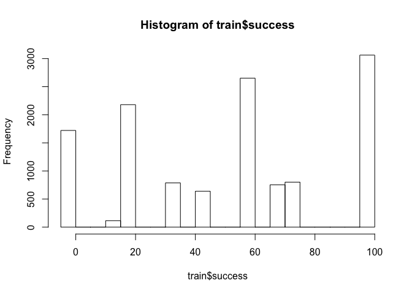<!-- -->

    hist(train$handling_time)

<!-- -->

    hist(train$hyperlink_clicks)

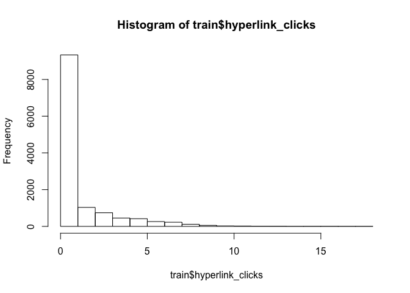<!-- -->

    hist(train$magnify_clicks)

<!-- -->

    hist(train$expert_clicks)

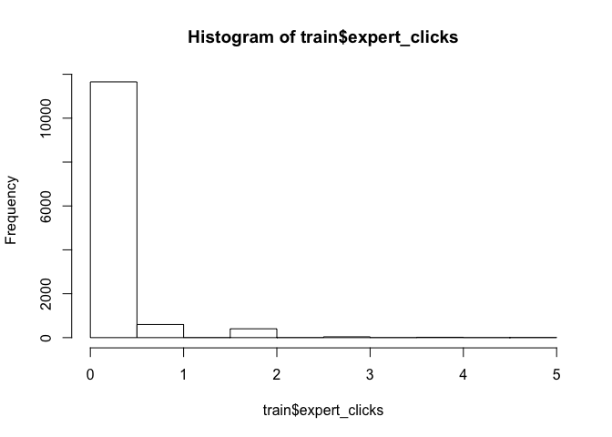<!-- -->

First Models
------------

    source('scripts/models.R')

    ## Loading required package: party

    ## Loading required package: grid

    ## Loading required package: mvtnorm

    ## Loading required package: modeltools

    ## Loading required package: stats4

    ## Loading required package: strucchange

    ## Loading required package: zoo

    ## 
    ## Attaching package: 'zoo'

    ## The following objects are masked from 'package:base':
    ## 
    ##     as.Date, as.Date.numeric

    ## Loading required package: sandwich

<!-- -->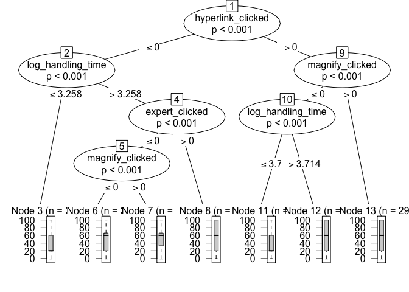<!-- -->

### Logistic

There appears to be a strong relationship between performance and clicks
on the magnify button and expert buttons. But the relationship is less
clear with handling time and hyperlink clicks.

    mylogit <- glm(label ~ hyperlink_clicks + magnify_clicks + expert_clicks + handling_time, data = train, family = "binomial")
    summary(mylogit)

    ## 
    ## Call:
    ## glm(formula = label ~ hyperlink_clicks + magnify_clicks + expert_clicks + 
    ##     handling_time, family = "binomial", data = train)
    ## 
    ## Deviance Residuals: 
    ##     Min       1Q   Median       3Q      Max  
    ## -2.1178  -1.2330   0.9234   1.0975   1.1369  
    ## 
    ## Coefficients:
    ##                   Estimate Std. Error z value Pr(>|z|)    
    ## (Intercept)      9.614e-02  2.390e-02   4.023 5.74e-05 ***
    ## hyperlink_clicks 5.770e-02  9.976e-03   5.784 7.31e-09 ***
    ## magnify_clicks   7.421e-02  1.178e-02   6.301 2.95e-10 ***
    ## expert_clicks    4.636e-02  4.552e-02   1.018    0.308    
    ## handling_time    1.999e-04  4.925e-05   4.058 4.94e-05 ***
    ## ---
    ## Signif. codes:  0 '***' 0.001 '**' 0.01 '*' 0.05 '.' 0.1 ' ' 1
    ## 
    ## (Dispersion parameter for binomial family taken to be 1)
    ## 
    ##     Null deviance: 17355  on 12708  degrees of freedom
    ## Residual deviance: 17176  on 12704  degrees of freedom
    ## AIC: 17186
    ## 
    ## Number of Fisher Scoring iterations: 4

However, the model still needs a lot of work. It does not appear very
accurate.

Train Accuracy:

    ##          actual
    ## predicted    0    1
    ##         0 4882 6133
    ##         1  560 1134

    ## [1] "accuracy:"         "0.473365331654733"

Test Accuracy:

    ##          actual
    ## predicted    0    1
    ##         0 1656 2003
    ##         1  198  396

    ## [1] "accuracy:"         "0.482482953209499"

### Decision Tree

Next I tried a decision tree, borrowing code from the classification
tutorial:

    mydat_tree <- ctree(label ~ hyperlink_clicks + magnify_clicks + expert_clicks + handling_time, data = train)
    plot(mydat_tree)

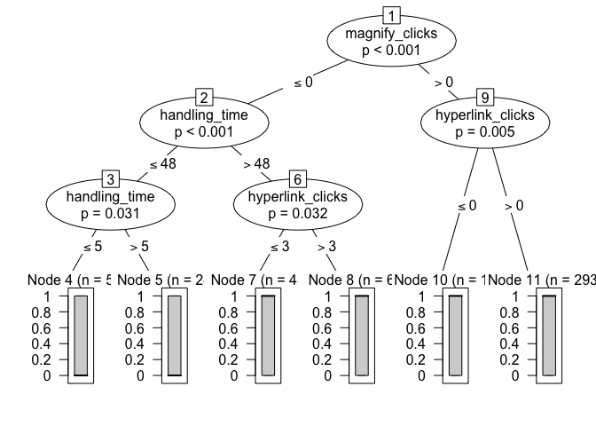<!-- -->

Train Accuracy:

    ##          actual
    ## predicted    0    1
    ##         0 1687 1330
    ##         1 3755 5937

    ## [1] "accuracy:"         "0.599889841844362"

Test Accuracy:

    ##          actual
    ## predicted    0    1
    ##         0  575  425
    ##         1 1279 1974

    ## [1] "accuracy:"         "0.599341641194451"

Log-transform and binary variables
----------------------------------

Here I convert hyperlink, magnify and expert link clicks to binary (0 vs
1+) and handling time to logistic

    mylogit2 <- glm(label ~ hyperlink_clicked + magnify_clicked + expert_clicked + log_handling_time, data = train, family = "binomial")
    summary(mylogit2)

    ## 
    ## Call:
    ## glm(formula = label ~ hyperlink_clicked + magnify_clicked + expert_clicked + 
    ##     log_handling_time, family = "binomial", data = train)
    ## 
    ## Deviance Residuals: 
    ##     Min       1Q   Median       3Q      Max  
    ## -1.6791  -1.2461   0.8935   1.0509   1.3972  
    ## 
    ## Coefficients:
    ##                   Estimate Std. Error z value Pr(>|z|)    
    ## (Intercept)       -0.50316    0.06009  -8.373  < 2e-16 ***
    ## hyperlink_clicked  0.19711    0.04236   4.654 3.26e-06 ***
    ## magnify_clicked    0.23174    0.04400   5.266 1.39e-07 ***
    ## expert_clicked     0.12669    0.07210   1.757   0.0789 .  
    ## log_handling_time  0.13288    0.01339   9.921  < 2e-16 ***
    ## ---
    ## Signif. codes:  0 '***' 0.001 '**' 0.01 '*' 0.05 '.' 0.1 ' ' 1
    ## 
    ## (Dispersion parameter for binomial family taken to be 1)
    ## 
    ##     Null deviance: 17355  on 12708  degrees of freedom
    ## Residual deviance: 17023  on 12704  degrees of freedom
    ## AIC: 17033
    ## 
    ## Number of Fisher Scoring iterations: 4

However, the model still needs a lot of work. It does not appear very
accurate.

Train Accuracy:

    ##          actual
    ## predicted    0    1
    ##         0 4443 5294
    ##         1  999 1973

    ## [1] "accuracy:"         "0.504839090408372"

Test Accuracy:

    ##          actual
    ## predicted    0    1
    ##         0 1503 1739
    ##         1  351  660

    ## [1] "accuracy:"         "0.508582177286621"

### Decision Tree

Decision tree with the binary and logistic variables.

    mydat_tree2 <- ctree(label ~ hyperlink_clicked + magnify_clicked + expert_clicked + log_handling_time, data = train)
    plot(mydat_tree2)

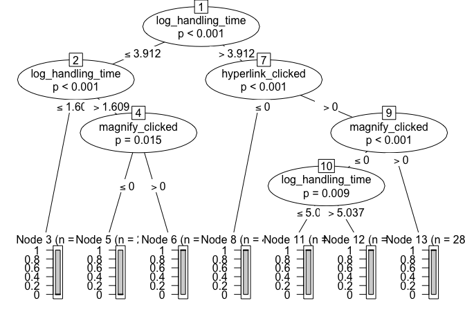<!-- -->

Train Accuracy:

    ##          actual
    ## predicted    0    1
    ##         0 2150 1884
    ##         1 3292 5383

    ## [1] "accuracy:"         "0.592729561727909"

Test Accuracy:

    ##          actual
    ## predicted    0    1
    ##         0  720  623
    ##         1 1134 1776

    ## [1] "accuracy:"         "0.586879849517987"

Bucketing handling time
-----------------------

Bucket handling time into segments: for each unit there is an indicator
for if the student spent less than 20 seconds on it, as well an
indicator for spending more than 100 seconds.

    logit <- glm(label ~ hyperlink_clicked + magnify_clicked + expert_clicked + time_lt_20 + time_gt_100, data = train, family = "binomial")
    print(summary(logit))

    ## 
    ## Call:
    ## glm(formula = label ~ hyperlink_clicked + magnify_clicked + expert_clicked + 
    ##     time_lt_20 + time_gt_100, family = "binomial", data = train)
    ## 
    ## Deviance Residuals: 
    ##     Min       1Q   Median       3Q      Max  
    ## -1.5531  -1.2584   0.9018   1.0558   1.3168  
    ## 
    ## Coefficients:
    ##                   Estimate Std. Error z value Pr(>|z|)    
    ## (Intercept)        0.02177    0.03803   0.573   0.5670    
    ## hyperlink_clicked  0.16673    0.04287   3.889   0.0001 ***
    ## magnify_clicked    0.22979    0.04387   5.238 1.63e-07 ***
    ## expert_clicked     0.16077    0.07190   2.236   0.0254 *  
    ## time_lt_20        -0.34354    0.06048  -5.680 1.35e-08 ***
    ## time_gt_100        0.27130    0.04483   6.052 1.43e-09 ***
    ## ---
    ## Signif. codes:  0 '***' 0.001 '**' 0.01 '*' 0.05 '.' 0.1 ' ' 1
    ## 
    ## (Dispersion parameter for binomial family taken to be 1)
    ## 
    ##     Null deviance: 17355  on 12708  degrees of freedom
    ## Residual deviance: 17003  on 12703  degrees of freedom
    ## AIC: 17015
    ## 
    ## Number of Fisher Scoring iterations: 4

    tab = confusion_matrix(logit,train)
    print(tab)

    ##          actual
    ## predicted    0    1
    ##         0 4529 5363
    ##         1  913 1904

    accuracy = get_accuracy(tab)
    print(c("logit accuracy:",accuracy))

    ## [1] "logit accuracy:"   "0.506176725155402"

Spending a very short time (&lt;20 seconds) on the learning activities
does indeed make a student less likely to succeed on the assessment. On
the other hand spending more than 100 seconds makes a student more
likely to succeed

Individual Assessment Cards
---------------------------

Here I'll attempt to separate out model performance for each individual
assessment card, rather than lumping them all together. This will solve
two problems: one, that success is measured differently for different
assessment cards. And two, it can tell me the relative impact that
different activity cards have on their respective assessments. For
example, maybe activity cards 1-4 impact assessment card 5 more than
activities 6-9 do on assessment 10.

    for (a in assessment_cards) {
      cat("\n***************************************************\n----------\n|CARD",a,"|\n----------")
      subtrain = get_single_card(train,a)
      logit <- glm(label ~ hyperlink_clicked + magnify_clicked + expert_clicked + time_lt_20 + time_gt_100, data = subtrain, family = "binomial")
      display_results(logit,subtrain,subtrain$label)
      tree <- ctree(label ~ hyperlink_clicked + magnify_clicked + expert_clicked + log_handling_time, data = subtrain)
      plot(tree)
      tab = confusion_matrix(tree,subtrain)
      print(tab)
      accuracy = get_accuracy(tab)
      print(c("tree accuracy:",accuracy))
    }

    ## 
    ## ***************************************************
    ## ----------
    ## |CARD 5 |
    ## ----------
    ## Call:
    ## glm(formula = label ~ hyperlink_clicked + magnify_clicked + expert_clicked + 
    ##     time_lt_20 + time_gt_100, family = "binomial", data = subtrain)
    ## 
    ## Deviance Residuals: 
    ##     Min       1Q   Median       3Q      Max  
    ## -1.3616  -1.1199  -0.6478   1.2360   1.8246  
    ## 
    ## Coefficients:
    ##                    Estimate Std. Error z value Pr(>|z|)    
    ## (Intercept)        -0.53630    0.09835  -5.453 4.95e-08 ***
    ## hyperlink_clicked   0.11566    0.22962   0.504 0.614467    
    ## magnify_clicked     0.44431    0.09756   4.554 5.26e-06 ***
    ## expert_clicked    -12.87358  324.74371  -0.040 0.968378    
    ## time_lt_20         -0.91856    0.24288  -3.782 0.000156 ***
    ## time_gt_100         0.39951    0.11278   3.543 0.000396 ***
    ## ---
    ## Signif. codes:  0 '***' 0.001 '**' 0.01 '*' 0.05 '.' 0.1 ' ' 1
    ## 
    ## (Dispersion parameter for binomial family taken to be 1)
    ## 
    ##     Null deviance: 2937.2  on 2125  degrees of freedom
    ## Residual deviance: 2844.3  on 2120  degrees of freedom
    ## AIC: 2856.3
    ## 
    ## Number of Fisher Scoring iterations: 11
    ## 
    ##          actual
    ## predicted    0    1
    ##         0 1136  990
    ## [1] "accuracy:"         "0.534336782690499"

    ##          actual
    ## predicted    0    1
    ##         0 1127  960
    ##         1    9   30
    ## [1] "tree accuracy:"    "0.544214487300094"
    ## 
    ## ***************************************************
    ## ----------
    ## |CARD 9 |
    ## ----------
    ## Call:
    ## glm(formula = label ~ hyperlink_clicked + magnify_clicked + expert_clicked + 
    ##     time_lt_20 + time_gt_100, family = "binomial", data = subtrain)
    ## 
    ## Deviance Residuals: 
    ##     Min       1Q   Median       3Q      Max  
    ## -1.6192  -1.3779   0.8763   0.9196   1.2116  
    ## 
    ## Coefficients: (1 not defined because of singularities)
    ##                   Estimate Std. Error z value Pr(>|z|)    
    ## (Intercept)         0.4600     0.1046   4.396  1.1e-05 ***
    ## hyperlink_clicked  -0.1170     0.1121  -1.044 0.296670    
    ## magnify_clicked     0.2377     0.1280   1.857 0.063289 .  
    ## expert_clicked          NA         NA      NA       NA    
    ## time_lt_20         -0.5400     0.1587  -3.402 0.000669 ***
    ## time_gt_100         0.2990     0.1236   2.419 0.015542 *  
    ## ---
    ## Signif. codes:  0 '***' 0.001 '**' 0.01 '*' 0.05 '.' 0.1 ' ' 1
    ## 
    ## (Dispersion parameter for binomial family taken to be 1)
    ## 
    ##     Null deviance: 2798.0  on 2149  degrees of freedom
    ## Residual deviance: 2750.9  on 2145  degrees of freedom
    ## AIC: 2760.9
    ## 
    ## Number of Fisher Scoring iterations: 4

    ## Warning in predict.lm(object, newdata, se.fit, scale = 1, type =
    ## ifelse(type == : prediction from a rank-deficient fit may be misleading

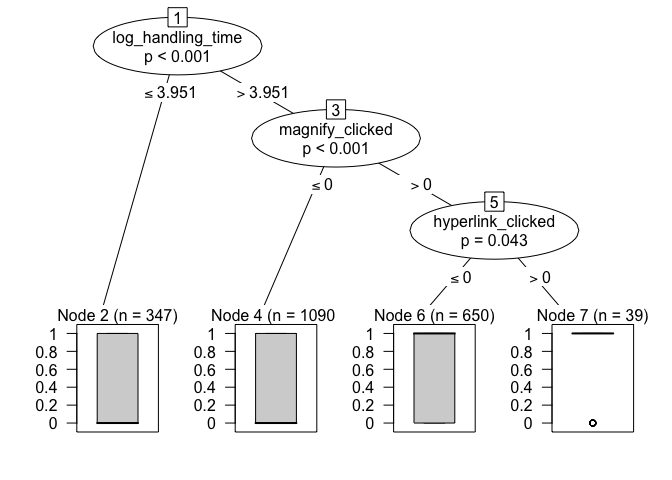<!-- -->

    ##          actual
    ## predicted    0    1
    ##         0  288  358
    ##         1  476 1028
    ## [1] "accuracy:"         "0.612093023255814"

    ##          actual
    ## predicted    0    1
    ##         0  177  171
    ##         1  587 1215
    ## [1] "tree accuracy:"    "0.647441860465116"
    ## 
    ## ***************************************************
    ## ----------
    ## |CARD 12 |
    ## ----------
    ## Call:
    ## glm(formula = label ~ hyperlink_clicked + magnify_clicked + expert_clicked + 
    ##     time_lt_20 + time_gt_100, family = "binomial", data = subtrain)
    ## 
    ## Deviance Residuals: 
    ##     Min       1Q   Median       3Q      Max  
    ## -1.5342  -1.3006   0.8585   0.9685   1.6161  
    ## 
    ## Coefficients: (1 not defined because of singularities)
    ##                   Estimate Std. Error z value Pr(>|z|)    
    ## (Intercept)        0.08370    0.08701   0.962  0.33606    
    ## hyperlink_clicked  0.29471    0.10707   2.753  0.00591 ** 
    ## magnify_clicked    0.22869    0.11339   2.017  0.04371 *  
    ## expert_clicked          NA         NA      NA       NA    
    ## time_lt_20        -1.07351    0.21627  -4.964 6.91e-07 ***
    ## time_gt_100        0.20126    0.11215   1.795  0.07273 .  
    ## ---
    ## Signif. codes:  0 '***' 0.001 '**' 0.01 '*' 0.05 '.' 0.1 ' ' 1
    ## 
    ## (Dispersion parameter for binomial family taken to be 1)
    ## 
    ##     Null deviance: 2876.8  on 2125  degrees of freedom
    ## Residual deviance: 2789.3  on 2121  degrees of freedom
    ## AIC: 2799.3
    ## 
    ## Number of Fisher Scoring iterations: 4

    ## Warning in predict.lm(object, newdata, se.fit, scale = 1, type =
    ## ifelse(type == : prediction from a rank-deficient fit may be misleading

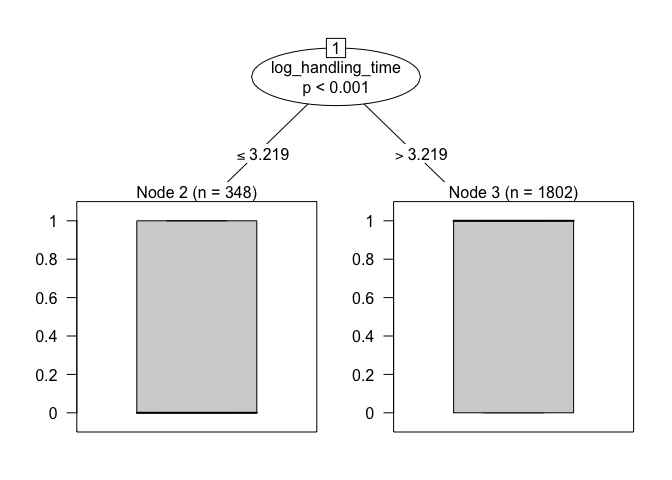<!-- -->

    ##          actual
    ## predicted   0   1
    ##         0 507 545
    ##         1 363 711
    ## [1] "accuracy:"         "0.572906867356538"

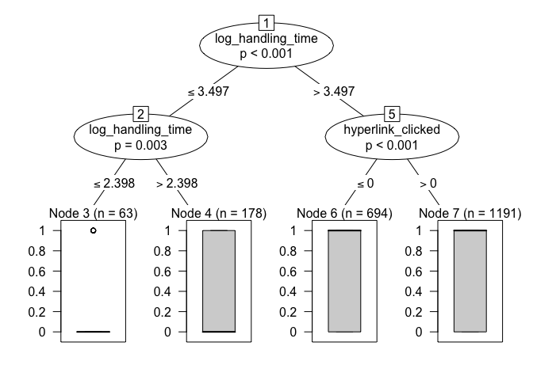<!-- -->

    ##          actual
    ## predicted   0   1
    ##         0 458 477
    ##         1 412 779
    ## [1] "tree accuracy:"    "0.581843838193791"
    ## 
    ## ***************************************************
    ## ----------
    ## |CARD 15 |
    ## ----------
    ## Call:
    ## glm(formula = label ~ hyperlink_clicked + magnify_clicked + expert_clicked + 
    ##     time_lt_20 + time_gt_100, family = "binomial", data = subtrain)
    ## 
    ## Deviance Residuals: 
    ##     Min       1Q   Median       3Q      Max  
    ## -1.4902  -1.1964   0.9027   1.0027   1.1814  
    ## 
    ## Coefficients:
    ##                   Estimate Std. Error z value Pr(>|z|)   
    ## (Intercept)        0.03218    0.10720   0.300  0.76407   
    ## hyperlink_clicked -0.01104    0.12696  -0.087  0.93068   
    ## magnify_clicked    0.26120    0.11296   2.312  0.02076 * 
    ## expert_clicked     0.02348    0.12274   0.191  0.84832   
    ## time_lt_20        -0.03052    0.14937  -0.204  0.83811   
    ## time_gt_100        0.39381    0.12994   3.031  0.00244 **
    ## ---
    ## Signif. codes:  0 '***' 0.001 '**' 0.01 '*' 0.05 '.' 0.1 ' ' 1
    ## 
    ## (Dispersion parameter for binomial family taken to be 1)
    ## 
    ##     Null deviance: 2782.3  on 2062  degrees of freedom
    ## Residual deviance: 2742.3  on 2057  degrees of freedom
    ## AIC: 2754.3
    ## 
    ## Number of Fisher Scoring iterations: 4
    ## 
    ##          actual
    ## predicted   0   1
    ##         0 537 659
    ##         1 295 572
    ## [1] "accuracy:"         "0.537566650508968"

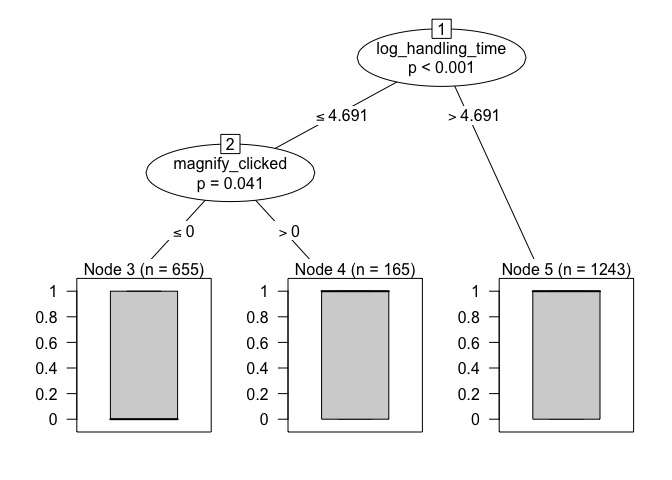<!-- -->

    ##          actual
    ## predicted   0   1
    ##         0 331 324
    ##         1 501 907
    ## [1] "tree accuracy:"    "0.600096946194862"
    ## 
    ## ***************************************************
    ## ----------
    ## |CARD 19 |
    ## ----------
    ## Call:
    ## glm(formula = label ~ hyperlink_clicked + magnify_clicked + expert_clicked + 
    ##     time_lt_20 + time_gt_100, family = "binomial", data = subtrain)
    ## 
    ## Deviance Residuals: 
    ##     Min       1Q   Median       3Q      Max  
    ## -1.5787  -1.4302   0.8236   0.8946   1.1255  
    ## 
    ## Coefficients:
    ##                     Estimate Std. Error z value Pr(>|z|)    
    ## (Intercept)        5.770e-01  1.039e-01   5.554 2.79e-08 ***
    ## hyperlink_clicked  4.886e-02  1.275e-01   0.383  0.70155    
    ## magnify_clicked    1.978e-01  1.150e-01   1.720  0.08550 .  
    ## expert_clicked     2.837e-05  1.128e-01   0.000  0.99980    
    ## time_lt_20        -4.537e-01  1.545e-01  -2.937  0.00332 ** 
    ## time_gt_100        8.336e-02  1.280e-01   0.651  0.51503    
    ## ---
    ## Signif. codes:  0 '***' 0.001 '**' 0.01 '*' 0.05 '.' 0.1 ' ' 1
    ## 
    ## (Dispersion parameter for binomial family taken to be 1)
    ## 
    ##     Null deviance: 2754.2  on 2156  degrees of freedom
    ## Residual deviance: 2720.7  on 2151  degrees of freedom
    ## AIC: 2732.7
    ## 
    ## Number of Fisher Scoring iterations: 4
    ## 
    ##          actual
    ## predicted    0    1
    ##         0  142  161
    ##         1  583 1271
    ## [1] "accuracy:"         "0.655076495132128"

    ##          actual
    ## predicted    0    1
    ##         0  181  204
    ##         1  544 1228
    ## [1] "tree accuracy:"    "0.653222067686602"
    ## 
    ## ***************************************************
    ## ----------
    ## |CARD 21 |
    ## ----------
    ## Call:
    ## glm(formula = label ~ hyperlink_clicked + magnify_clicked + expert_clicked + 
    ##     time_lt_20 + time_gt_100, family = "binomial", data = subtrain)
    ## 
    ## Deviance Residuals: 
    ##     Min       1Q   Median       3Q      Max  
    ## -1.3193  -1.1118  -0.9688   1.2189   1.4014  
    ## 
    ## Coefficients: (1 not defined because of singularities)
    ##                   Estimate Std. Error z value Pr(>|z|)    
    ## (Intercept)       -0.18993    0.09330  -2.036 0.041782 *  
    ## hyperlink_clicked  0.03367    0.11600   0.290 0.771625    
    ## magnify_clicked    0.39089    0.11473   3.407 0.000657 ***
    ## expert_clicked          NA         NA      NA       NA    
    ## time_lt_20        -0.32269    0.12263  -2.631 0.008507 ** 
    ## time_gt_100        0.09283    0.11181   0.830 0.406430    
    ## ---
    ## Signif. codes:  0 '***' 0.001 '**' 0.01 '*' 0.05 '.' 0.1 ' ' 1
    ## 
    ## (Dispersion parameter for binomial family taken to be 1)
    ## 
    ##     Null deviance: 2883.4  on 2086  degrees of freedom
    ## Residual deviance: 2837.6  on 2082  degrees of freedom
    ## AIC: 2847.6
    ## 
    ## Number of Fisher Scoring iterations: 4

    ## Warning in predict.lm(object, newdata, se.fit, scale = 1, type =
    ## ifelse(type == : prediction from a rank-deficient fit may be misleading

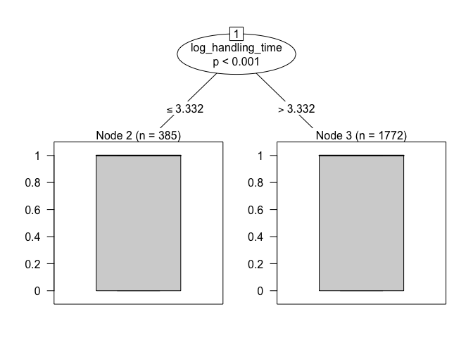<!-- -->

    ##          actual
    ## predicted    0    1
    ##         0 1115  972
    ## [1] "accuracy:"         "0.534259702922856"

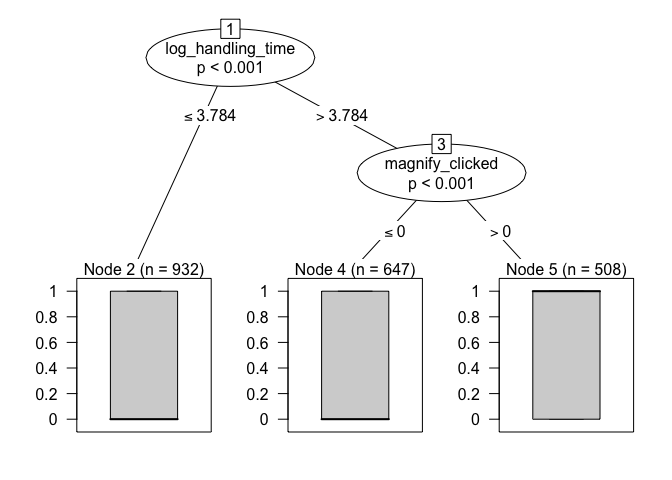<!-- -->

    ##          actual
    ## predicted   0   1
    ##         0 908 671
    ##         1 207 301
    ## [1] "tree accuracy:"    "0.579300431241016"

Individual Assessment Cards and Engagement Cards
------------------------------------------------

Here I split further to try and measure the impact of each engagement
card's components on student performance. For example, rather than
combining cards 1-4 and measuring the aggregate impact on performance, I
consider engagement activities from card 1 separately from engagement
activities on card 2, etc.

    data_w = widen(df)
    train_w = data_w[[1]]
    test_w = data_w[[2]]

Modeling engagement activities associated with the assessment on card 5:

    logit <- glm(label_5 ~ 
                   hyperlink_clicked_1 + hyperlink_clicked_2 + hyperlink_clicked_4 + hyperlink_clicked_5 
                 + magnify_clicked_4 + magnify_clicked_5 
                 + time_lt_20_1 + time_lt_20_2 + time_lt_20_3 + time_lt_20_4 + time_lt_20_5
                 + time_gt_100_1 + time_gt_100_2 + time_gt_100_3 + time_gt_100_4 + time_gt_100_5,
                 data=train_w, family="binomial")
    display_results(logit,train_w,train_w$label_5,threshold=0.3)

    ## 
    ## Call:
    ## glm(formula = label_5 ~ hyperlink_clicked_1 + hyperlink_clicked_2 + 
    ##     hyperlink_clicked_4 + hyperlink_clicked_5 + magnify_clicked_4 + 
    ##     magnify_clicked_5 + time_lt_20_1 + time_lt_20_2 + time_lt_20_3 + 
    ##     time_lt_20_4 + time_lt_20_5 + time_gt_100_1 + time_gt_100_2 + 
    ##     time_gt_100_3 + time_gt_100_4 + time_gt_100_5, family = "binomial", 
    ##     data = train_w)
    ## 
    ## Deviance Residuals: 
    ##    Min      1Q  Median      3Q     Max  
    ## -1.570  -1.107  -0.295   1.080   2.561  
    ## 
    ## Coefficients:
    ##                       Estimate Std. Error z value Pr(>|z|)    
    ## (Intercept)          -0.510039   0.206719  -2.467   0.0136 *  
    ## hyperlink_clicked_1   0.335857   0.251439   1.336   0.1816    
    ## hyperlink_clicked_2  12.048003 324.743842   0.037   0.9704    
    ## hyperlink_clicked_4 -12.088941 324.743756  -0.037   0.9703    
    ## hyperlink_clicked_5   0.015261   0.108901   0.140   0.8885    
    ## magnify_clicked_4     0.203664   0.116659   1.746   0.0808 .  
    ## magnify_clicked_5     0.473317   0.111157   4.258 2.06e-05 ***
    ## time_lt_20_1          0.057108   0.117257   0.487   0.6262    
    ## time_lt_20_2          0.097996   0.148316   0.661   0.5088    
    ## time_lt_20_3         -0.361159   0.142264  -2.539   0.0111 *  
    ## time_lt_20_4         -0.325851   0.140242  -2.323   0.0202 *  
    ## time_lt_20_5         -2.071157   0.472690  -4.382 1.18e-05 ***
    ## time_gt_100_1         0.026534   0.159972   0.166   0.8683    
    ## time_gt_100_2        -0.009543   0.212809  -0.045   0.9642    
    ## time_gt_100_3        -0.096651   0.111142  -0.870   0.3845    
    ## time_gt_100_4        -0.096790   0.116747  -0.829   0.4071    
    ## time_gt_100_5         0.244161   0.122238   1.997   0.0458 *  
    ## ---
    ## Signif. codes:  0 '***' 0.001 '**' 0.01 '*' 0.05 '.' 0.1 ' ' 1
    ## 
    ## (Dispersion parameter for binomial family taken to be 1)
    ## 
    ##     Null deviance: 2940.4  on 2128  degrees of freedom
    ## Residual deviance: 2732.0  on 2112  degrees of freedom
    ##   (35 observations deleted due to missingness)
    ## AIC: 2766
    ## 
    ## Number of Fisher Scoring iterations: 11
    ## 
    ##          actual
    ## predicted   0   1
    ##         0 902 628
    ##         1 239 360
    ## [1] "accuracy:"         "0.592766557069046"

    display_results(logit,test_w,test_w$label_5)

    ## 
    ## Call:
    ## glm(formula = label_5 ~ hyperlink_clicked_1 + hyperlink_clicked_2 + 
    ##     hyperlink_clicked_4 + hyperlink_clicked_5 + magnify_clicked_4 + 
    ##     magnify_clicked_5 + time_lt_20_1 + time_lt_20_2 + time_lt_20_3 + 
    ##     time_lt_20_4 + time_lt_20_5 + time_gt_100_1 + time_gt_100_2 + 
    ##     time_gt_100_3 + time_gt_100_4 + time_gt_100_5, family = "binomial", 
    ##     data = train_w)
    ## 
    ## Deviance Residuals: 
    ##    Min      1Q  Median      3Q     Max  
    ## -1.570  -1.107  -0.295   1.080   2.561  
    ## 
    ## Coefficients:
    ##                       Estimate Std. Error z value Pr(>|z|)    
    ## (Intercept)          -0.510039   0.206719  -2.467   0.0136 *  
    ## hyperlink_clicked_1   0.335857   0.251439   1.336   0.1816    
    ## hyperlink_clicked_2  12.048003 324.743842   0.037   0.9704    
    ## hyperlink_clicked_4 -12.088941 324.743756  -0.037   0.9703    
    ## hyperlink_clicked_5   0.015261   0.108901   0.140   0.8885    
    ## magnify_clicked_4     0.203664   0.116659   1.746   0.0808 .  
    ## magnify_clicked_5     0.473317   0.111157   4.258 2.06e-05 ***
    ## time_lt_20_1          0.057108   0.117257   0.487   0.6262    
    ## time_lt_20_2          0.097996   0.148316   0.661   0.5088    
    ## time_lt_20_3         -0.361159   0.142264  -2.539   0.0111 *  
    ## time_lt_20_4         -0.325851   0.140242  -2.323   0.0202 *  
    ## time_lt_20_5         -2.071157   0.472690  -4.382 1.18e-05 ***
    ## time_gt_100_1         0.026534   0.159972   0.166   0.8683    
    ## time_gt_100_2        -0.009543   0.212809  -0.045   0.9642    
    ## time_gt_100_3        -0.096651   0.111142  -0.870   0.3845    
    ## time_gt_100_4        -0.096790   0.116747  -0.829   0.4071    
    ## time_gt_100_5         0.244161   0.122238   1.997   0.0458 *  
    ## ---
    ## Signif. codes:  0 '***' 0.001 '**' 0.01 '*' 0.05 '.' 0.1 ' ' 1
    ## 
    ## (Dispersion parameter for binomial family taken to be 1)
    ## 
    ##     Null deviance: 2940.4  on 2128  degrees of freedom
    ## Residual deviance: 2732.0  on 2112  degrees of freedom
    ##   (35 observations deleted due to missingness)
    ## AIC: 2766
    ## 
    ## Number of Fisher Scoring iterations: 11
    ## 
    ##          actual
    ## predicted   0   1
    ##         0 390 330
    ##         1   7  13
    ## [1] "accuracy:"         "0.544594594594595"

Refining the model:

    logit <- glm(label_5 ~ 
                 magnify_clicked_5 
                 + time_lt_20_3 + time_lt_20_4 + time_lt_20_5,
                 data=train_w, family="binomial")
    display_results(logit,train_w,train_w$label_5,0.1)

    ## 
    ## Call:
    ## glm(formula = label_5 ~ magnify_clicked_5 + time_lt_20_3 + time_lt_20_4 + 
    ##     time_lt_20_5, family = "binomial", data = train_w)
    ## 
    ## Deviance Residuals: 
    ##     Min       1Q   Median       3Q      Max  
    ## -1.3205  -1.0706  -0.2943   1.0408   2.5143  
    ## 
    ## Coefficients:
    ##                   Estimate Std. Error z value Pr(>|z|)    
    ## (Intercept)       -0.25643    0.08761  -2.927 0.003422 ** 
    ## magnify_clicked_5  0.58671    0.09769   6.006 1.90e-09 ***
    ## time_lt_20_3      -0.34792    0.13265  -2.623 0.008717 ** 
    ## time_lt_20_4      -0.42684    0.12330  -3.462 0.000537 ***
    ## time_lt_20_5      -2.08647    0.47112  -4.429 9.48e-06 ***
    ## ---
    ## Signif. codes:  0 '***' 0.001 '**' 0.01 '*' 0.05 '.' 0.1 ' ' 1
    ## 
    ## (Dispersion parameter for binomial family taken to be 1)
    ## 
    ##     Null deviance: 2940.4  on 2128  degrees of freedom
    ## Residual deviance: 2744.7  on 2124  degrees of freedom
    ##   (35 observations deleted due to missingness)
    ## AIC: 2754.7
    ## 
    ## Number of Fisher Scoring iterations: 5
    ## 
    ##          actual
    ## predicted   0   1
    ##         0 723 431
    ##         1 418 557
    ## [1] "accuracy:"         "0.601221230624706"

Modeling engagement activities associated with the assessment on card 9:

    logit <- glm(label_9 ~ 
                   hyperlink_clicked_1 + hyperlink_clicked_2 + hyperlink_clicked_4 + hyperlink_clicked_5 + hyperlink_clicked_6 + hyperlink_clicked_8 + hyperlink_clicked_9
                 + magnify_clicked_4 + magnify_clicked_5 + magnify_clicked_7 + magnify_clicked_9 
                 + time_lt_20_1 + time_lt_20_2 + time_lt_20_3 + time_lt_20_4 + time_lt_20_5 + time_lt_20_6 + time_lt_20_7 + time_lt_20_8 + time_lt_20_9
                 + time_gt_100_1 + time_gt_100_2 + time_gt_100_3 + time_gt_100_4 + time_gt_100_5 + time_gt_100_6 + time_gt_100_7 + time_gt_100_8 + time_gt_100_9,
                 data=train_w, family="binomial")
    display_results(logit,train_w,train_w$label_5,threshold=0.3)

    ## 
    ## Call:
    ## glm(formula = label_9 ~ hyperlink_clicked_1 + hyperlink_clicked_2 + 
    ##     hyperlink_clicked_4 + hyperlink_clicked_5 + hyperlink_clicked_6 + 
    ##     hyperlink_clicked_8 + hyperlink_clicked_9 + magnify_clicked_4 + 
    ##     magnify_clicked_5 + magnify_clicked_7 + magnify_clicked_9 + 
    ##     time_lt_20_1 + time_lt_20_2 + time_lt_20_3 + time_lt_20_4 + 
    ##     time_lt_20_5 + time_lt_20_6 + time_lt_20_7 + time_lt_20_8 + 
    ##     time_lt_20_9 + time_gt_100_1 + time_gt_100_2 + time_gt_100_3 + 
    ##     time_gt_100_4 + time_gt_100_5 + time_gt_100_6 + time_gt_100_7 + 
    ##     time_gt_100_8 + time_gt_100_9, family = "binomial", data = train_w)
    ## 
    ## Deviance Residuals: 
    ##     Min       1Q   Median       3Q      Max  
    ## -1.9076  -1.2742   0.7663   0.9316   1.5973  
    ## 
    ## Coefficients:
    ##                       Estimate Std. Error z value Pr(>|z|)   
    ## (Intercept)           0.681963   0.228463   2.985  0.00284 **
    ## hyperlink_clicked_1  -0.007410   0.254755  -0.029  0.97679   
    ## hyperlink_clicked_2 -14.583743 535.411312  -0.027  0.97827   
    ## hyperlink_clicked_4  12.846225 535.411268   0.024  0.98086   
    ## hyperlink_clicked_5   0.207791   0.132831   1.564  0.11774   
    ## hyperlink_clicked_6  -0.094231   0.131760  -0.715  0.47450   
    ## hyperlink_clicked_8 -14.062157 535.411229  -0.026  0.97905   
    ## hyperlink_clicked_9  -0.243756   0.128045  -1.904  0.05695 . 
    ## magnify_clicked_4    -0.063821   0.131419  -0.486  0.62723   
    ## magnify_clicked_5    -0.005041   0.170395  -0.030  0.97640   
    ## magnify_clicked_7     0.393703   0.144931   2.716  0.00660 **
    ## magnify_clicked_9     0.377993   0.168972   2.237  0.02529 * 
    ## time_lt_20_1          0.105784   0.121132   0.873  0.38250   
    ## time_lt_20_2          0.160408   0.153433   1.045  0.29581   
    ## time_lt_20_3          0.039551   0.156160   0.253  0.80006   
    ## time_lt_20_4         -0.111625   0.155478  -0.718  0.47279   
    ## time_lt_20_5         -0.356981   0.270707  -1.319  0.18727   
    ## time_lt_20_6         -0.152238   0.159329  -0.955  0.33933   
    ## time_lt_20_7         -0.291437   0.168617  -1.728  0.08392 . 
    ## time_lt_20_8         -0.256704   0.155651  -1.649  0.09910 . 
    ## time_lt_20_9         -0.496804   0.263656  -1.884  0.05953 . 
    ## time_gt_100_1        -0.164300   0.164156  -1.001  0.31689   
    ## time_gt_100_2         0.183521   0.224655   0.817  0.41398   
    ## time_gt_100_3        -0.160462   0.123016  -1.304  0.19210   
    ## time_gt_100_4         0.144660   0.132459   1.092  0.27478   
    ## time_gt_100_5        -0.079679   0.136525  -0.584  0.55947   
    ## time_gt_100_6        -0.067041   0.132393  -0.506  0.61259   
    ## time_gt_100_7         0.059152   0.136154   0.434  0.66396   
    ## time_gt_100_8        -0.008352   0.130683  -0.064  0.94904   
    ## time_gt_100_9        -0.270271   0.122208  -2.212  0.02700 * 
    ## ---
    ## Signif. codes:  0 '***' 0.001 '**' 0.01 '*' 0.05 '.' 0.1 ' ' 1
    ## 
    ## (Dispersion parameter for binomial family taken to be 1)
    ## 
    ##     Null deviance: 2751.4  on 2115  degrees of freedom
    ## Residual deviance: 2634.0  on 2086  degrees of freedom
    ##   (48 observations deleted due to missingness)
    ## AIC: 2694
    ## 
    ## Number of Fisher Scoring iterations: 12
    ## 
    ##          actual
    ## predicted   0   1
    ##         0 345 116
    ##         1 787 868
    ## [1] "accuracy:"         "0.573251417769376"

    display_results(logit,test_w,test_w$label_5)

    ## 
    ## Call:
    ## glm(formula = label_9 ~ hyperlink_clicked_1 + hyperlink_clicked_2 + 
    ##     hyperlink_clicked_4 + hyperlink_clicked_5 + hyperlink_clicked_6 + 
    ##     hyperlink_clicked_8 + hyperlink_clicked_9 + magnify_clicked_4 + 
    ##     magnify_clicked_5 + magnify_clicked_7 + magnify_clicked_9 + 
    ##     time_lt_20_1 + time_lt_20_2 + time_lt_20_3 + time_lt_20_4 + 
    ##     time_lt_20_5 + time_lt_20_6 + time_lt_20_7 + time_lt_20_8 + 
    ##     time_lt_20_9 + time_gt_100_1 + time_gt_100_2 + time_gt_100_3 + 
    ##     time_gt_100_4 + time_gt_100_5 + time_gt_100_6 + time_gt_100_7 + 
    ##     time_gt_100_8 + time_gt_100_9, family = "binomial", data = train_w)
    ## 
    ## Deviance Residuals: 
    ##     Min       1Q   Median       3Q      Max  
    ## -1.9076  -1.2742   0.7663   0.9316   1.5973  
    ## 
    ## Coefficients:
    ##                       Estimate Std. Error z value Pr(>|z|)   
    ## (Intercept)           0.681963   0.228463   2.985  0.00284 **
    ## hyperlink_clicked_1  -0.007410   0.254755  -0.029  0.97679   
    ## hyperlink_clicked_2 -14.583743 535.411312  -0.027  0.97827   
    ## hyperlink_clicked_4  12.846225 535.411268   0.024  0.98086   
    ## hyperlink_clicked_5   0.207791   0.132831   1.564  0.11774   
    ## hyperlink_clicked_6  -0.094231   0.131760  -0.715  0.47450   
    ## hyperlink_clicked_8 -14.062157 535.411229  -0.026  0.97905   
    ## hyperlink_clicked_9  -0.243756   0.128045  -1.904  0.05695 . 
    ## magnify_clicked_4    -0.063821   0.131419  -0.486  0.62723   
    ## magnify_clicked_5    -0.005041   0.170395  -0.030  0.97640   
    ## magnify_clicked_7     0.393703   0.144931   2.716  0.00660 **
    ## magnify_clicked_9     0.377993   0.168972   2.237  0.02529 * 
    ## time_lt_20_1          0.105784   0.121132   0.873  0.38250   
    ## time_lt_20_2          0.160408   0.153433   1.045  0.29581   
    ## time_lt_20_3          0.039551   0.156160   0.253  0.80006   
    ## time_lt_20_4         -0.111625   0.155478  -0.718  0.47279   
    ## time_lt_20_5         -0.356981   0.270707  -1.319  0.18727   
    ## time_lt_20_6         -0.152238   0.159329  -0.955  0.33933   
    ## time_lt_20_7         -0.291437   0.168617  -1.728  0.08392 . 
    ## time_lt_20_8         -0.256704   0.155651  -1.649  0.09910 . 
    ## time_lt_20_9         -0.496804   0.263656  -1.884  0.05953 . 
    ## time_gt_100_1        -0.164300   0.164156  -1.001  0.31689   
    ## time_gt_100_2         0.183521   0.224655   0.817  0.41398   
    ## time_gt_100_3        -0.160462   0.123016  -1.304  0.19210   
    ## time_gt_100_4         0.144660   0.132459   1.092  0.27478   
    ## time_gt_100_5        -0.079679   0.136525  -0.584  0.55947   
    ## time_gt_100_6        -0.067041   0.132393  -0.506  0.61259   
    ## time_gt_100_7         0.059152   0.136154   0.434  0.66396   
    ## time_gt_100_8        -0.008352   0.130683  -0.064  0.94904   
    ## time_gt_100_9        -0.270271   0.122208  -2.212  0.02700 * 
    ## ---
    ## Signif. codes:  0 '***' 0.001 '**' 0.01 '*' 0.05 '.' 0.1 ' ' 1
    ## 
    ## (Dispersion parameter for binomial family taken to be 1)
    ## 
    ##     Null deviance: 2751.4  on 2115  degrees of freedom
    ## Residual deviance: 2634.0  on 2086  degrees of freedom
    ##   (48 observations deleted due to missingness)
    ## AIC: 2694
    ## 
    ## Number of Fisher Scoring iterations: 12
    ## 
    ##          actual
    ## predicted   0   1
    ##         0 209 131
    ##         1 182 212
    ## [1] "accuracy:"         "0.573569482288828"

Refining model 9:

    logit <- glm(label_9 ~ 
                   hyperlink_clicked_6 + hyperlink_clicked_8 + hyperlink_clicked_9
                 + magnify_clicked_7 + magnify_clicked_9 
                 + time_lt_20_6 + time_lt_20_7 + time_lt_20_8 + time_lt_20_9
                 + time_gt_100_6 + time_gt_100_7 + time_gt_100_8 + time_gt_100_9,
                 data=train_w, family="binomial")
    display_results(logit,train_w,train_w$label_5,threshold=0.3)

    ## 
    ## Call:
    ## glm(formula = label_9 ~ hyperlink_clicked_6 + hyperlink_clicked_8 + 
    ##     hyperlink_clicked_9 + magnify_clicked_7 + magnify_clicked_9 + 
    ##     time_lt_20_6 + time_lt_20_7 + time_lt_20_8 + time_lt_20_9 + 
    ##     time_gt_100_6 + time_gt_100_7 + time_gt_100_8 + time_gt_100_9, 
    ##     family = "binomial", data = train_w)
    ## 
    ## Deviance Residuals: 
    ##     Min       1Q   Median       3Q      Max  
    ## -1.8812  -1.2965   0.7818   0.9180   1.4597  
    ## 
    ## Coefficients:
    ##                       Estimate Std. Error z value Pr(>|z|)    
    ## (Intercept)           0.826818   0.135111   6.120 9.39e-10 ***
    ## hyperlink_clicked_6  -0.047680   0.126760  -0.376 0.706813    
    ## hyperlink_clicked_8 -13.054659 324.743730  -0.040 0.967934    
    ## hyperlink_clicked_9  -0.168962   0.116982  -1.444 0.148643    
    ## magnify_clicked_7     0.375384   0.139810   2.685 0.007254 ** 
    ## magnify_clicked_9     0.374289   0.112142   3.338 0.000845 ***
    ## time_lt_20_6         -0.174179   0.153859  -1.132 0.257604    
    ## time_lt_20_7         -0.316956   0.159382  -1.989 0.046739 *  
    ## time_lt_20_8         -0.270235   0.150608  -1.794 0.072767 .  
    ## time_lt_20_9         -0.660644   0.220271  -2.999 0.002707 ** 
    ## time_gt_100_6        -0.117913   0.127296  -0.926 0.354296    
    ## time_gt_100_7         0.060962   0.131051   0.465 0.641805    
    ## time_gt_100_8        -0.007227   0.128064  -0.056 0.955000    
    ## time_gt_100_9        -0.274043   0.117160  -2.339 0.019332 *  
    ## ---
    ## Signif. codes:  0 '***' 0.001 '**' 0.01 '*' 0.05 '.' 0.1 ' ' 1
    ## 
    ## (Dispersion parameter for binomial family taken to be 1)
    ## 
    ##     Null deviance: 2751.4  on 2115  degrees of freedom
    ## Residual deviance: 2650.9  on 2102  degrees of freedom
    ##   (48 observations deleted due to missingness)
    ## AIC: 2678.9
    ## 
    ## Number of Fisher Scoring iterations: 11
    ## 
    ##          actual
    ## predicted   0   1
    ##         0 334 111
    ##         1 798 873
    ## [1] "accuracy:"         "0.570415879017013"

    display_results(logit,test_w,test_w$label_5)

    ## 
    ## Call:
    ## glm(formula = label_9 ~ hyperlink_clicked_6 + hyperlink_clicked_8 + 
    ##     hyperlink_clicked_9 + magnify_clicked_7 + magnify_clicked_9 + 
    ##     time_lt_20_6 + time_lt_20_7 + time_lt_20_8 + time_lt_20_9 + 
    ##     time_gt_100_6 + time_gt_100_7 + time_gt_100_8 + time_gt_100_9, 
    ##     family = "binomial", data = train_w)
    ## 
    ## Deviance Residuals: 
    ##     Min       1Q   Median       3Q      Max  
    ## -1.8812  -1.2965   0.7818   0.9180   1.4597  
    ## 
    ## Coefficients:
    ##                       Estimate Std. Error z value Pr(>|z|)    
    ## (Intercept)           0.826818   0.135111   6.120 9.39e-10 ***
    ## hyperlink_clicked_6  -0.047680   0.126760  -0.376 0.706813    
    ## hyperlink_clicked_8 -13.054659 324.743730  -0.040 0.967934    
    ## hyperlink_clicked_9  -0.168962   0.116982  -1.444 0.148643    
    ## magnify_clicked_7     0.375384   0.139810   2.685 0.007254 ** 
    ## magnify_clicked_9     0.374289   0.112142   3.338 0.000845 ***
    ## time_lt_20_6         -0.174179   0.153859  -1.132 0.257604    
    ## time_lt_20_7         -0.316956   0.159382  -1.989 0.046739 *  
    ## time_lt_20_8         -0.270235   0.150608  -1.794 0.072767 .  
    ## time_lt_20_9         -0.660644   0.220271  -2.999 0.002707 ** 
    ## time_gt_100_6        -0.117913   0.127296  -0.926 0.354296    
    ## time_gt_100_7         0.060962   0.131051   0.465 0.641805    
    ## time_gt_100_8        -0.007227   0.128064  -0.056 0.955000    
    ## time_gt_100_9        -0.274043   0.117160  -2.339 0.019332 *  
    ## ---
    ## Signif. codes:  0 '***' 0.001 '**' 0.01 '*' 0.05 '.' 0.1 ' ' 1
    ## 
    ## (Dispersion parameter for binomial family taken to be 1)
    ## 
    ##     Null deviance: 2751.4  on 2115  degrees of freedom
    ## Residual deviance: 2650.9  on 2102  degrees of freedom
    ##   (48 observations deleted due to missingness)
    ## AIC: 2678.9
    ## 
    ## Number of Fisher Scoring iterations: 11
    ## 
    ##          actual
    ## predicted   0   1
    ##         0 201 105
    ##         1 192 238
    ## [1] "accuracy:"         "0.596467391304348"

Next Steps
----------

Come up with the best model from this log
