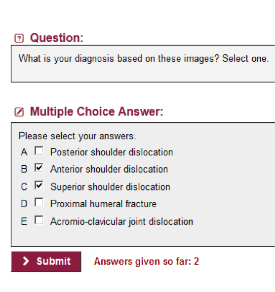
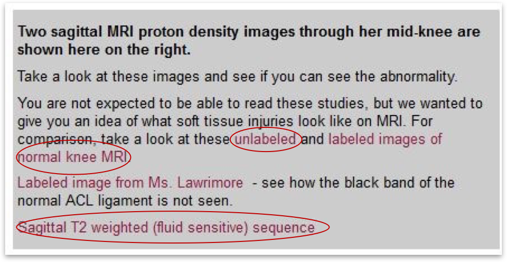
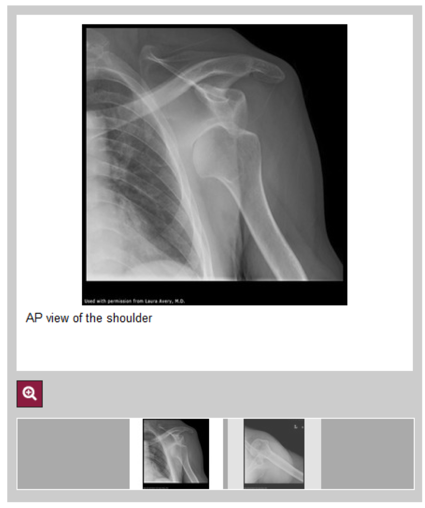

Identifying Effective Learning Activities in an Online Course
========================================================
author: Charlie Guthrie
date: May 2, 2016
APSTA-GE 2017: Educational Data Science Practicum

 
========================================================
</img>
***

23-card online course

Learning activities on cards include:
- reading material
- links
- images
- assessments throughout

About the Data
========================================================
title:false
<!-- # -->
</img>

Goal
========================================================
Identify which learning activities were most effective at increasing student assessment performance.

Project Overview
========================================================
1. Predict a student's performance from his/her overall level of engagement in the class. 
1. Predict performance given specific learning activities.

Key Variables
========================================================
Assessment cards  
***

Key Variables
========================================================
Variables that may have an impact on student performance:

  * **Clicking hyperlinks**
  * Magnifying images
  * Checking answers using "expert" links
  * Time spent on cards
  
***

  
Key Variables
========================================================
Variables that may have an impact on student performance:

  * Clicking hyperlinks
  * **Magnifying images**
  * Checking answers using "expert" links
  * Time spent on cards
  
***

Key Variables
========================================================
Variables that may have an impact on student performance:

  * Clicking hyperlinks
  * Magnifying images
  * **Checking answers using "expert" links**
  * Time spent on cards
  
***

Key Variables
========================================================
Variables that may have an impact on student performance:

  * Clicking hyperlinks
  * Magnifying images
  * Checking answers using "expert" links
  * **Time spent on cards**
  
***

Key Variables
========================================================

Initial experiment
========================================================
1. First I did a broad model to establish taht there was a relationship between student engagement and performance.  In other words, good study habits produce better results.

Results of initial experiment
========================================================
Indeed a relationship.  Show how?  With scatter plot?  

1. First say there was significance in model
1. Say students who did x were y more likely to get answer right

More detailed experiment
========================================================
1. Then I broke the data down to identify exactly which components of the lesson cards were useful for achieving better performance
1. Tweaked the models for better accuracy

Results
========================================================
List of significant results for each unit. What activities contributed to performance?
May need actual cards to demonstrate this.  

Thanks
========================================================
To Matt Cirigliano, Martin Pusic, and Oleksandr Savenkov of NYU School of Medicine for providing data and consultation.
