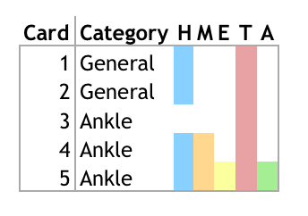

<style>
.reveal h1, .reveal h2, .reveal h3 {
  word-wrap: normal;
  -moz-hyphens: none;
  hyphens: none;
}
img {
  box-shadow:none;
  border:0px;
}
.midcenter {
    position: fixed;
    top: 50%;
    left: 50%;
}
.wide .reveal{
  margin: 10px
}
.exclaim .reveal .state-background {
  background: black;
} 

.exclaim .reveal h1,
.exclaim .reveal h2,
.exclaim .reveal h3,
.exclaim .reveal p {
  color: white;
}
</style>


Identifying Effective Learning Activities in an Online Course
========================================================
author: Charlie Guthrie
date: May 2, 2016
transition: none

APSTA-GE 2017: Educational Data Science Practicum


Goal
========================================================
Identify which learning activities were most effective at increasing student assessment performance.

 
========================================================
</img>

***

23-card online course

Learning activities on cards include:
- reading material
- links
- images
- assessments throughout


About the Data
========================================================
title:false
</img>

Key Variables
========================================================
Assessment cards  
***
</img>

Key Variables
========================================================
Variables that may have an impact on student performance:

  * **Clicking hyperlinks**
  * Magnifying images
  * Checking answers using "expert" links
  * Time spent on cards
  
***
</img>
  
Key Variables
========================================================
Variables that may have an impact on student performance:

  * Clicking hyperlinks
  * **Magnifying images**
  * Checking answers using "expert" links
  * Time spent on cards
  
***
</img>

Key Variables
========================================================
Variables that may have an impact on student performance:

  * Clicking hyperlinks
  * Magnifying images
  * **Checking answers using "expert" links**
  * Time spent on cards
  
***
</img>

Key Variables
========================================================
Variables that may have an impact on student performance:

  * Clicking hyperlinks
  * Magnifying images
  * Checking answers using "expert" links
  * **Time spent on cards**
  
***


Key Variables
========================================================
Not all activities are present on all cards.
</img>

Project Overview
========================================================
<h3>Investigation 1</h3>
Predict student performance from overall activity engagement. 

<h3>Investigation 2</h3>
Measure impact of specific learning activities and cards.

Investigation 1: Does Studying Work?
========================================================
Is there a relationship between student engagement and performance?

Investigation 1: Does Studying Work?
========================================================
</img>
</img>

Investigation 1: Procedure
========================================================
1. Restructure data: 1 line per student per assessment
    - assessments are aggregated together
1. Data transformations
   - converting clicks to binary
   - log-transform and binary transform of handling_time
1. Model predicts if student will pass any assessment given relevant material

Investigation 1: Results
========================================================
title: false
<font size=6>

```

Call:
glm(formula = label ~ hyperlink_clicked + magnify_clicked + expert_clicked + 
    time_lt_20 + time_gt_100, family = "binomial", data = train)

Deviance Residuals: 
    Min       1Q   Median       3Q      Max  
-1.5531  -1.2584   0.9018   1.0558   1.3168  

Coefficients:
                  Estimate Std. Error z value Pr(>|z|)    
(Intercept)        0.02177    0.03803   0.573   0.5670    
hyperlink_clicked  0.16673    0.04287   3.889   0.0001 ***
magnify_clicked    0.22979    0.04387   5.238 1.63e-07 ***
expert_clicked     0.16077    0.07190   2.236   0.0254 *  
time_lt_20        -0.34354    0.06048  -5.680 1.35e-08 ***
time_gt_100        0.27130    0.04483   6.052 1.43e-09 ***
---
Signif. codes:  0 '***' 0.001 '**' 0.01 '*' 0.05 '.' 0.1 ' ' 1

(Dispersion parameter for binomial family taken to be 1)

    Null deviance: 17355  on 12708  degrees of freedom
Residual deviance: 17003  on 12703  degrees of freedom
AIC: 17015

Number of Fisher Scoring iterations: 4
```
</font>

Investigation 1: Results
========================================================

|   |Model Type |Activity Measure |Time Spent      |AUC   |
|:--|:----------|:----------------|:---------------|:-----|
|1  |logistic   |scalar           |scalar          |0.588 |
|2  |logistic   |scalar           |log-transformed |0.589 |
|3  |logistic   |binary           |log-transformed |0.593 |
|4  |logistic   |binary           |binary          |0.594 |
|5  |tree       |scalar           |scalar          |0.592 |
|6  |tree       |scalar           |log-transformed |0.597 |
|7  |tree       |binary           |log-transformed |0.596 |
|8  |tree       |binary           |binary          |0.594 |

```
[1] "auc on test of model 4 = 0.61"
```

Investigation 2
========================================================
Which specific learning activities helped assessment score?

</img>

Investigation 2: Procedure
========================================================
Which activities help students answer the question on card 5?
</img>
</img>

Investigation 2: Procedure
========================================================
1. Run lasso-regularized logistic regression using all activities before assessment card
1. Find largest regularization parameter that is close to maximum cross-validation AUC
1. Re-run logistic with remaining variables
1. Return variables that have significant impact with p-value < 0.05

Investigation 2: Results
========================================================
</img>

Investigation 2: Results
========================================================
What activities contributed to performance on each assessment card?

|Card |AUC   |Significant Variables                                                                                                                 |
|:----|:-----|:-------------------------------------------------------------------------------------------------------------------------------------|
|5    |0.631 |(Intercept), magnify_clicked_5, time_lt_20_3, time_lt_20_4, time_lt_20_5                                                              |
|9    |0.626 |(Intercept), label_5, magnify_clicked_9, time_lt_20_5, time_lt_20_7                                                                   |
|12   |0.648 |label_5, label_9, hyperlink_clicked_10, time_lt_20_5, time_lt_20_9, time_lt_20_12                                                     |
|15   |0.563 |(Intercept), time_lt_20_5, time_gt_100_15                                                                                             |
|19   |0.616 |label_5, label_12, label_15, hyperlink_clicked_18, magnify_clicked_19, time_lt_20_2, time_lt_20_15, time_lt_20_19, time_gt_100_19     |
|21   |0.628 |label_5, label_9, label_19, hyperlink_clicked_21, magnify_clicked_20, expert_clicked_19, time_lt_20_15, time_lt_20_20, time_gt_100_21 |

Investigation 2: Results
========================================================
</img>

Next Steps
========================================================
- Close analysis of card content
- Discussion with MedU content designers
- Make re-usable for any online course.
- Use more robust, summative assessment.

Thanks
========================================================
To Matt Cirigliano, Martin Pusic, and Oleksandr Savenkov of NYU School of Medicine for providing data and consultation.
